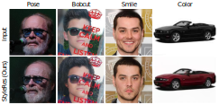
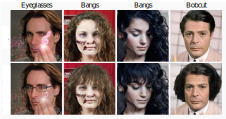

# StyleRes: Transforming the Residuals for Real Image Editing with StyleGAN (CVPR 2023)

<!-- [supp.]() -->
[Paper (CVPR)](https://openaccess.thecvf.com/content/CVPR2023/papers/Pehlivan_StyleRes_Transforming_the_Residuals_for_Real_Image_Editing_With_StyleGAN_CVPR_2023_paper.pdf) | [Paper (Arxiv)](https://arxiv.org/abs/2212.14359) | [Website](https://www.cs.bilkent.edu.tr/~adundar/projects/StyleRes/) | [Demo](https://huggingface.co/spaces/hamzapehlivan/StyleRes) | [Colab](https://colab.research.google.com/github/hamzapehlivan/StyleRes/blob/master/colab_inference.ipynb) | [Video](https://www.youtube.com/watch?v=S9ZswKv8enw) | [Supp.](https://openaccess.thecvf.com/content/CVPR2023/supplemental/Pehlivan_StyleRes_Transforming_the_CVPR_2023_supplemental.pdf)

<p float="left">

 
<br>

</p>
<p align="center">
Our inversion model adopts high-rate feature maps for incoming edits, so the quality of the edit is not compromised while retaining most of the image details. In this example, we show various edits using InterfaceGAN, GANSpace and StyleClip. 
</p>


## To Do List
- [x] Release the inference code and demo. 
- [x] Add StyleClip's global directions
- [x] Release Colab notebook.
- [x] Add GradCtrl edits
- [ ] Release the evaluation code. 
- [ ] Release the training code. 

## Prerequisites
- Linux
    - Tested on Ubuntu 18.04. 
- Can be run on CPU or Nvidia GPU.
    - At least for 4GB GPU memory required for the GPU execution.
    - StyleGAN uses system wide installation of CUDA to compile custom C++ codes. We have tested the code with CUDA 10.1 and upwards. 
- [Anaconda](https://www.anaconda.com/) is recommended to install the dependencies. 
## Installation
- Install CUDA library (10.1 or upwards). One can follow NVIDIA Developer [website](https://developer.nvidia.com/cuda-downloads?target_os=Linux). Make sure that CUDA_HOME environment variable is set, as indicated in the post installation steps. 
- Clone this repository:
```
git clone https://github.com/hamzapehlivan/StyleRes.git
cd StyleRes
```
- Install the dependencies and activate the environment:
```
conda env create -f environment.yml
conda activate styleres
```
### Pretrained Models
Download the pretrained models used in our work. 
| Path | Description
| :--- | :----------
|[StyleRes (Face)](https://drive.google.com/file/d/1SXNe_txGQaGQg3AthSdwlBAlDPjlzFet/view?usp=sharing)  | FFHQ StyleRes encoder. Includes StyleGAN2 generator and e4e base encoder
|[Facial Landmark](https://drive.google.com/file/d/1FCUAmqkVpJsNpgz4k_odYaL91gIW4hQm/view?usp=sharing) | (Optional) Landmark model used in face alignment. 

<!-- |[Cars Inversion](https://drive.google.com/file/d/17faPqBce2m1AQeLCLHUVXaDfxMRU2QcV/view?usp=sharing)  | Cars e4e encoder. -->

Our code assumes that the StyleRes encoder is saved to `checkpoints` directory. However, you can change it with the `--checkpoint_path` flag.

## Demo
We provide a GUI application accessible [online](https://huggingface.co/spaces/hamzapehlivan/StyleRes). Also, the application can be run locally, using [gradio](https://gradio.app/) library. First, download the library with `pip install gradio` command. Then, you can run the demo with the following:
```
python app.py --device=cpu
```
,where the device argument can be either `cpu` or `cuda`. 
## Inference
Even though our model is not supervised for certain edits, it can entegrate with the existing image editing frameworks.
This repository currently supports:
 
- Smile, pose and age edits with InterfaceGAN.
- 42 GANSpace edits. See the [config](editings/ganspace_pca/ganspace_configs.csv) file for the complete list. 
- 9 edits using StyleClip's mapper network. See the [config](editings/styleclip_directions/styleclip_mapping_configs.csv) file for the list. One can also utilize global directions method of StyleClip. We gave 17 examples in [this](editings/styleclip_directions/styleclip_global_examples.csv) file. Note that you should install the CLIP library for the global directions method:
```
pip install git+https://github.com/openai/CLIP.git
```
- Smile, age, eyeglasses and gender edits with GradCtrl. 

To edit images in the `inference_samples` directory, run the inference code as:
```
python inference.py --datadir=samples/inference_samples --outdir=results --edit_configs=options/editing_options/template.py
```
or alternatively, run the bash file directly:
```
bash inference.sh
```
`--edit_configs` includes configurations for each edit. We gave some examples on how to specify an edit in the [template](options/editing_options/template.py) file. `--resize_outputs` flag can be used to resize the output images to 256x256 resolution. In the first run with GPU, StyleGAN2 compiles Pytorch extensions, which can take 1-2 minutes. The config files for each edit is in CSV format, therefore, one can better investigate by converting them into table.

If the test images are not aligned, you should align them with  a landmark detector. First, install the [dlib](http://dlib.net/) library:
```
apt install cmake
pip install dlib scipy
```
With `--aligner_path` argument, specify the path of the downloaded landmark detector model. 

## License 
This work is available under [NVIDIA Source Code License](LICENSE). 
This means that our work can solely be used for non-commercial purposes.

## Related Works
This work builds upon a GAN inversion framework [e4e](https://github.com/omertov/encoder4editing) in order to invert images into the latent and feature spaces of [StyleGAN2](https://github.com/NVlabs/stylegan3).

We got inspired from various inversion works, and used the source code of some of them. The main ones are [HFGI](https://github.com/Tengfei-Wang/HFGI), [Hyperstyle](https://github.com/yuval-alaluf/hyperstyle) and [IDInvert](https://github.com/genforce/genforce).    

In our work, we show that GAN inversion models should be designed with editings in mind. Although we did not use any of the editing methods while training, we showcase that a wide range edits found by [Interfacegan](https://github.com/genforce/interfacegan), [GANSpace](https://github.com/harskish/ganspace), [StyleClip](https://github.com/orpatashnik/StyleCLIP) and [GradCtrl](https://github.com/zikuncshelly/GradCtrl) are still applicable. 


# Citation
You can cite our work using the following:
```
@InProceedings{Pehlivan_2023_CVPR,
    author    = {Pehlivan, Hamza and Dalva, Yusuf and Dundar, Aysegul},
    title     = {StyleRes: Transforming the Residuals for Real Image Editing With StyleGAN},
    booktitle = {Proceedings of the IEEE/CVF Conference on Computer Vision and Pattern Recognition (CVPR)},
    month     = {June},
    year      = {2023},
    pages     = {1828-1837}
}
```